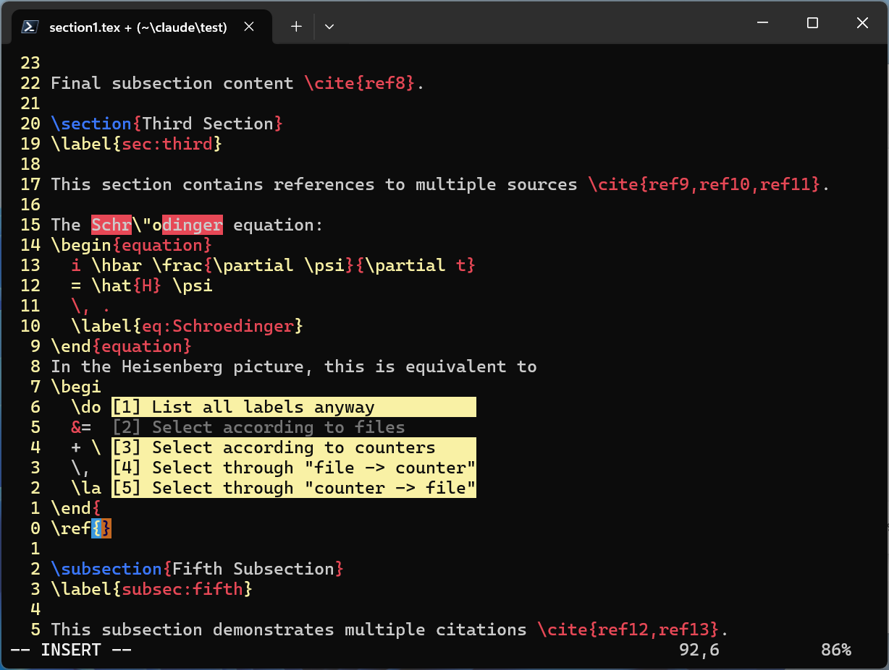

# TeX Labels: a Plugin for Vim

This is a powerful Vim plugin for LaTeX reference completion and management.
When Vim enters the insert mode withing the curly brace after a command `\ref`,
`\eqref`, `\pageref` or `\cite`, this plugin provides intelligent popup menus,
containing cross reference markers for selection.  The selected item is
automatically inserted into the curly brace.  The old marker, if existing before
the popup menu was triggered, will be erased automatically.


When Vim is in insert mode within the curly brance after `\label`, `\cite` or
`\tag`, the user is prompted if there are some potentially conflicting markers.

Large project of LaTeX document, containing several LaTeX files included or
input into a main LaTeX file, is also supported.  These make LaTeX document
editing more efficient.

## Features

- **Intelligent Popup Menus**: Context-sensitive popup completion for LaTeX
  references
- **Multiple Reference Types**: Support for labels, bibliography items, and tags
- **File Discovery**: Automatic detection of included LaTeX files
- **Counter-based Organization**: Organize labels by LaTeX counters (equation,
  figure, table, etc.)
- **File-based Navigation**: Browse references by source file
- **Duplicate Detection**: Real-time checking for duplicate labels and
  bibliography items
- **Auxiliary File Integration**: Seamless integration with LaTeX auxiliary
  files (.aux)
- **Cross-file Search**: Search across multiple included LaTeX files
- **Customizable Appearance**: Configurable popup colors and dimensions

## Requirements

- Vim 8.0+ or Neovim 0.4+ (with popup support)
- LaTeX distribution (for compilation and auxiliary file generation)

## Installation

You can install this plugin by any of the following methods.  It is recommended
that you install it manually.

### Manual Installation

Assume that your current work directory is the top directory of the source code
of this plugin.

1. Ensure the directory structure exists:
   ```
   mkdir -p ~/.vim/ftplugin/tex/
   mkdir -p ~/.vim/doc/
   ```
   If there are already the directories `~/.vim/ftplugin/tex` and `~/.vim/doc`,
   this step can be skipped.

2. Copy the file `tex-labels.vim` to your Vim configuration directory:
   ```
   cp ftplugin/tex/tex-labels.vim ~/.vim/ftplugin/tex/
   ```

3. Copy the help file:
   ```
   cp ftplugin/doc/tex-labels.txt ~/.vim/doc
   ```

### Using a Plugin Manager

Add the following to your `.vimrc` or `init.vim`:

#### vim-plug
```vim
Plug 'your-username/tex-labels', { 'for': 'tex' }
```

#### Vundle
```vim
Plugin 'your-username/tex-labels'
```

#### Pathogen
```vim
git clone https://github.com/zhoubihn/tex-labels.git ~/.vim/bundle/tex-labels
```

## Configuration

The plugin provides several configuration options. Add these, or one of these,
to your file `.vimrc` if you want to change the default configuration:

```vim
" Popup background color (default: 'LightYellow')
let g:tex_labels_popup_bg = 'LightYellow'

" Popup window height (default: 8)
let g:tex_labels_popup_height = 8

" Maximum number of labels to display (default: 32)
let g:tex_labels_limit = 32

" Number of lines to search for main file specification (default: 16)
let g:tex_labels_mainfile_scope = 16
```

On a Windows system, `.vimrc` might be `~\_vimrc` if your Vim is installed
with the default configuration.

## Usage

### Basic Reference Completion

1. **Triggering the Popup**: When editing a LaTeX file, the plugin automatically detects when you're working with reference commands:
   - `\ref{...}` - Cross-references
   - `\eqref{...}` - Equation references
   - `\pageref{...}` - Page references
   - `\cite{...}` - Citations

2. **Selecting Items**: Use the following keys in the popup menu:
   - `Enter` - Accept and insert selected reference
   - `j` or `n` - Move down
   - `k` or `p` or `N` - Move up
   - `Ctrl+F` or `Space` - Page down
   - `Ctrl+B` or `b` - Page up
   - `G` - Go to the last item
   - `gg` - Go to the first item
   - `Esc` - Close popup menu

   `Number + command` is supported.  For examples,
   - `12j` - Move down 12 lines
   - `8k` - Move up 8 lines
   - `11G` - Got to line 11

   The following popup menu does not accept `Number + command`:
   
   In fact, when you press a digit from `1` to `5`, the corresponding item
   is directly selected.  Alternatively, you can press `j`'s or `k`'s several
   times to move the cursor up and down, and press `Enter` when you are ready
   to accept the highlighted item.

### Working with Multiple Files

The plugin automatically detects included files using `\include` and `\input`
commands.  To specify a main file (useful for multi-file projects), add this
comment to the top of your LaTeX files:
```latex
%! Main file: main.tex
```
meansing that the current file is included or input in the file `main.tex`.
It is recommended that you add such a declaration in line 1 or line 2.
But you have the choice to put it in any line, with a line number not greater
than `g:tex_labels_mainfile_scope` (with defalut value `16`).
Without such a declaration, the current is treated as an independent LaTeX file.
If the file name in such a declaration is incorrect, the behavior of the plugin
is not predictable.

### Advanced Features

#### Counter-based Selection

When you have many labels (controlled by `g:tex_labels_limit`, with defalut
value `32`), the plugin offers organized browsing:

1. **List All Labels**: Browse all labels altogether
2. **By Counter**: Browse labels grouped by LaTeX counters (equation, figure,
  table, section, etc.)
3. **By File**: Browse references defined in certain a source file
4. **Hierarchical Navigation**: Navigate through files → counters → labels or
  through counters → files → labels

For an illustration, see, the above figure "File-counter organizing popup menu".

#### Duplicate Detection

The plugin automatically checks for duplicate labels and bibliography items
as you type.  When potential duplicates are found, a warning popup appears.

### Commands

- `:TestTexLabelsPopup` and `:TestTexBibsPopup` - Test the popup functionality
  (available in LaTeX buffers)

## How It Works

### File Discovery

1. **Main File Detection**: The plugin searches for `%! Main file: ...` comments
  in the first 16 lines of each file
2. **Include File Tracking**: Automatically parses `\include` and `\input`
  commands recursively
3. **Auxiliary File Processing**: Reads `.aux` files for up-to-date reference
  numbers and page information

### Cache Management

The plugin maintains auxiliary files for performance:
- `xxx.subf` - Lists of files that are included/input by the file `xxx.tex`
- `xxx.supf` - Contains which file inputs (by `\input`, not by `\include`)
  the file `xxx.tex`
- `xxx.label` - Cached label information defined in the file `xxx.tex`
- `xxx.bibitem` - Cached bibliography items defined in the file `xxx.tex`
- `xxx.tag` - Cached tag items defined in the file `xxx.tex`

These files are automatically updated when source files are modified.

### Popup Architecture

The plugin uses Vim's built-in popup functionality to create:
- Reference selection menus
- File browser popups
- Counter selection dialogs
- Warning and error messages

## Troubleshooting

### Common Issues

1. **Popup doesn't appear**:
   - Ensure you're using Vim 8.0+ or Neovim 0.4+
   - Check that popup support is enabled (`:echo has('popup')` should return 1)
   - Verify the file is recognized as LaTeX (`:set ft?` should show `tex`)

2. **References not found**:
   - Compile your LaTeX document first to generate `.aux` files
   - Check that main file specification is correct if using multi-file projects
   - Verify that labels are properly defined in your source files

3. **Performance issues**:
   - Reduce `g:tex_labels_limit` to display fewer items
   - Use main file specifications to limit search scope
   - Consider splitting very large documents

### Debug Mode

For debugging, you can check the plugin's internal state:

```vim
" Check if plugin is loaded
:echo b:loaded_tex_labels

" Check main file setting
:echo b:tex_labels_MainFile

" Check popup ID
:echo b:tex_labels_popup
```

## Contributing

Contributions are welcome! Please feel free to submit issues and pull requests.

### Development

The plugin is structured with clear separation of concerns:
- **File Discovery**: Functions for finding main files and included files
- **Reference Extraction**: Functions for parsing labels and bibliography items
- **Popup Management**: Functions for creating and controlling popup windows
- **Configuration**: Plugin settings and initialization

### Testing

To test the plugin:
1. Open a LaTeX file
2. Use `:TestTexLabelsPopup` and `:TestTexBibsPopup` to test basic functionality
3. Create test cases with various reference types
4. Verify cross-file functionality with included documents

## License

This plugin is distributed under the same terms as Vim itself (in Vim, see
`:help license`).

## Changelog

## Acknowledgments

This plugin was inspired by the need for efficient LaTeX reference management
in Vim. It builds upon Vim's powerful popup functionality and LaTeX's structured
reference system.

With the help of Anthropic's
[Claude Code](https://docs.claude.com/en/docs/claude-code/)
equipped with [zhipuAI/GLM-4.5](https://glm45.org),
and with the help of [Doubao (豆包)](https:/www.doubao.com),
this plugin is coded rapidly.  They are all appreciated!

A special thank is given to [Vim](https://vim.org)'s maintainers and its author,
momorable Bram Moolenaar.  Thanks for giving us an open, free and powerful
editor!

## Support

For issues, questions, or contributions, please open an issue
on the [project repository](https://github.com/zhoubihn/tex-labels).

This plugin has not been tested for [neovim](https://neovim.io).
Any information with the application in neovim is welcome.
